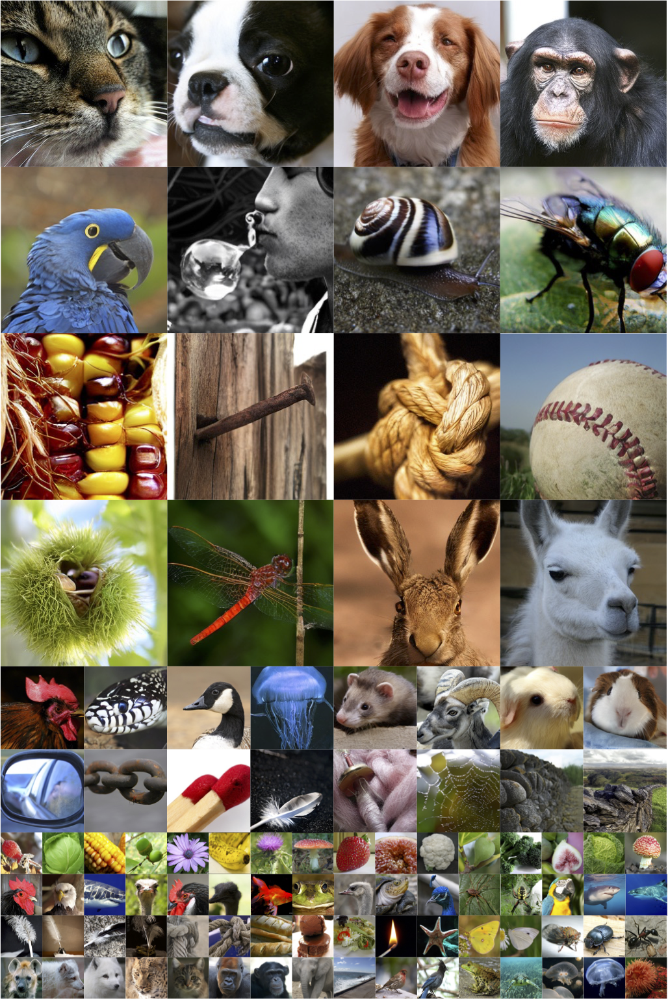
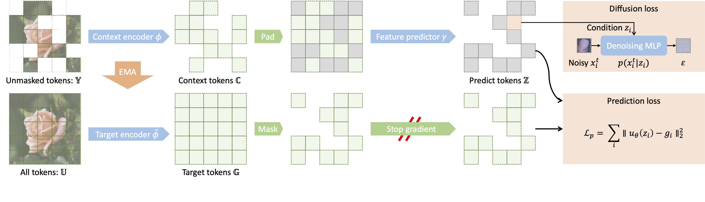
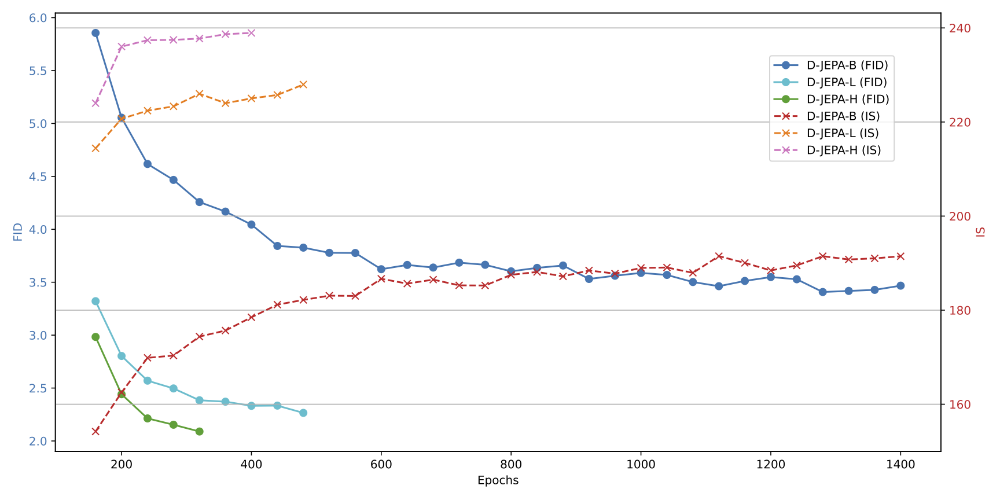

# D-JEPA: Denoising with a Joint-Embedding Predictive Architecture

The official implementation of the paper "Denoising with a Joint-Embedding Predictive Architecture".



[Homepage](https://d-jepa.github.io/) | [Paper](https://arxiv.org/abs/2410.03755)



## Installation

1. Create a conda environment and install dependencies: `conda env create -f environment.yml`

2. Download [KL16-VAE](https://www.dropbox.com/scl/fi/hhmuvaiacrarfg28qxhwz/kl16.ckpt?e=2&rlkey=l44xipsezc8atcffdp4q7mwmh&dl=0) pretrained by [MAR](https://github.com/LTH14/mar), then put it in: `pretrained_models/vae/kl16.ckpt`.

## Pretrained Models

[HuggingeFace](https://huggingface.co/densechen/d-jepa-imagenet)

|  Model   | #Params | FID (w/o cfg) |
| :------: | :-----: | :-----------: |
| D-JEPA-B |  212M   |     3.40      |
| D-JEPA-L |  687M   |     2.32      |
| D-JEPA-H |  1.4B   |     2.04      |

## Scripts

1. Cache VAE latents:
   ```sh
   bash scripts/cache_vae.sh
   ```
2. Train/Evaluate D-JEPA:
   ```sh
   bash scripts/djepa_base/large/huge.sh
   ```

**Note:** Before running scripts, you should replace the preset parameters in the scripts.



## Cite

If you find this work useful, please cite our paper:

```bibtex
@article{chen2024denoising,
  title={Denoising with a Joint-Embedding Predictive Architecture},
  author={Chen, Dengsheng and Hu, Jie and Wei, Xiaoming and Wu, Enhua},
  journal={arXiv preprint arXiv:2410.03755},
  year={2024}
}
```

## Acknowledgements

A large portion of codes in this repo is based on [MAR](https://github.com/LTH14/mar).